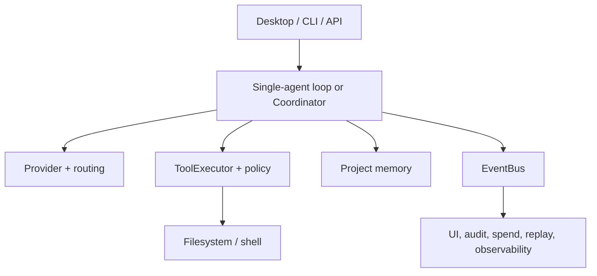

# Concerto architecture

**Last source reconciliation: 2026-08-03.** The Cargo manifests and executable
code are authoritative when this overview and the implementation differ.

## System shape

Concerto is a 24-crate Rust workspace with shared execution services and three
frontends: native desktop, terminal UI, and HTTP API. `concerto-core` owns
cross-cutting contracts—events, IDs, provider/tool/policy traits, errors,
cancellation, and the tool executor—without depending on another workspace
crate.

The detailed internal dependency edges are maintained in
[crate-graph.md](crate-graph.md).

## Interaction modes

`AgentMode` is part of task intent:

- **Chat** returns conversational text and does not grant project tools.
- **Plan** produces a plan and does not grant project tools.
- **Build** enables the action-required path and registered tools.

With multi-agent disabled, `AgentLoop` owns the run. With it enabled, Chat and
Plan remain Coordinator-only; Build uses `CoordinatorAgent` and the specialist
registry.

## Single-agent execution

`AgentLoop` sends messages and tool schemas to an `LlmProvider`, consumes the
stream, normalizes tool calls, evaluates each through `ToolExecutor`, returns
results to the model, and continues within configured budgets. It includes:

- context/token budget management;
- repeated tool-call cycle detection;
- cancellation tokens through async operations;
- configurable, cancellation-aware provider retry/backoff for transient failures;
- recoverable tool-error feedback;
- bounded autonomous continuation and non-convergence detection;
- blocked/partial outcomes that preserve useful progress.

## Multi-agent execution

The Coordinator plans a DAG of specialist subtasks. A task becomes ready only
after blocking dependencies complete; independent ready tasks may be dispatched
together. This prevents Reviewer or Validator from evaluating an implementation
that has not been produced.

The specialist registry contains Architect, Researcher, Coder, Reviewer, and
Validator. Only Coder receives write-capable tools. Directed collaboration
rules describe supervision, context, reporting, and design ownership; they are
configured through `MultiAgentConfig.relationships` and validated by
`RelationshipManager`.

Provider/model assignments are per role. Concerto uses objective compatibility
metadata—most importantly tool-call support for Researcher, Coder, and
Validator—not subjective capability tiers. All roles share the session spend
tracker.

The runtime topology is configuration-driven (ADR-35 phase 4): the Coordinator
plus every non-disabled built-in specialist and custom agent
(`CustomAgentConfig.disabled`) are the roles that get provider/model
resolution, in deterministic order (coordinator, built-ins, then custom
agents). Tool-calling routing follows the same topology: unconfigured
specialists keep the legacy Researcher/Coder/Validator requirement,
write/execute capabilities opt a built-in in, and custom agents opt in on any
capability; read-only capabilities never force a tool-calling model. The
Validator's eval engine is gated on `AgentCapabilities.eval` (default enabled,
including for configs written before the field existed).

Subtask failures are classified as `Recoverable` (retry same agent),
`LimitReached` (retries exhausted, or provider/model-specific hard failure:
auth, context overflow, no-affordable-model), or `NonRecoverable` (cancellation,
structural). `LimitReached` walks a two-tier ladder — same agent re-dispatched
on the global default model (same bound provider), then coordinator
self-execution (only for subtasks with no expected file artifact) — before
exiting the session gracefully with a partial/checkpoint outcome; hard failures
never reassign to another agent. See ADR-42.

See [Multi-agent Collaboration](agent-collaboration.md).

## Provider layer

`LlmProvider` defines provider identity, streaming completion, connection
testing, and model metadata. `concerto-providers` implements OpenAI, Anthropic,
Google, OpenRouter, Ollama, NVIDIA NIM, and OpenCode-compatible behavior. It also
owns OpenAI-compatible protocol normalization, token metering, retry wrapping,
provider construction, model profiles, and routing.

The selected provider and model form a pair. Explicit session/role selection is
authoritative unless invalid or unaffordable; fallback routing operates only
where no authoritative pair can be used. See [models.md](models.md).

## Tool, policy, and filesystem layers

`ToolExecutor` looks up a registered tool, builds a `PolicyAction`, evaluates
policy/spend constraints, requests approval when needed, and emits events around
execution. The current desktop/CLI coding registry contains `filesystem` and
`shell`.

`SimplePolicyEngine` evaluates configured rules in order; the first match wins,
and the engine denies unmatched calls. The desktop explicitly installs an
allow-all rule for expert/no-rules mode so an empty configuration remains
functional. `ShellTool` still applies its own hard denylist before any allow-all
configuration. See [policy-rules.md](policy-rules.md) and
[Security Boundaries](../SECURITY_BOUNDARIES.md).

`VirtualFs` stages filesystem changes for review and supplies diffs. Session
undo/snapshot support uses Git infrastructure where configured. These are safety
layers, not a substitute for an OS sandbox or independent backups.

## Shell execution

`concerto-config` owns shell profiles and host discovery. ADR-30 defines one
canonical selected profile for the primary consumer—the agent shell tool—and
for validation and the integrated terminal. Profiles store executable,
arguments, environment additions, working-directory behavior, and availability.

Only detected host shells and explicit user profiles are presented. The
separate `concerto-shell` crate implements the foundation of a typed AI-native
command runtime, but it is not yet the desktop terminal runtime. See
[shell-profiles.md](shell-profiles.md) and
[custom-ai-shell-plan.md](custom-ai-shell-plan.md).

## State, audit, and spending

`concerto-sessions` owns SQLite session persistence, migrations, audit records,
replay, and spend types. Runtime calls and policy checks share the same
`concerto-core::SpendTracker` implementation (re-exported by sessions), avoiding
independent multi-agent accounting.

Typed events flow through `EventBus`. Desktop/CLI state, audit persistence,
tool logs, spend displays, replay, and optional observability subscribers derive
from those events. Delivery is in-process; it is not a durable message broker.

## Memory

The active long-term memory path is:

1. walk the selected project and filter supported files;
2. create line-based chunks for recognized code/text and sliding-window chunks
   for other text;
3. produce local BGE small embeddings through `fastembed` (first use may
   download model data);
4. store chunks, embeddings, and FTS data in SQLite;
5. combine vector and FTS5 results with reciprocal-rank fusion;
6. isolate queries by project and refresh changed files via `notify`.

Tree-sitter is used for AST-aware chunking in supported languages (Rust,
Python, Go, TypeScript), with line-based and sliding-window fallbacks for other
content. SQLite is the vector store. Embedding failures can leave FTS-only/zero-vector
entries rather than silently calling a cloud embedding provider.

## Frontends

- **Desktop (`concerto-desktop`):** Iced views for Chat, Agents, Memory, Tool
  Log, Diff, Terminal, and Settings; recent sessions and session spend
  (status-bar chip, Spend Log modal) live in Chat. Async work is bridged into
  Iced messages/subscriptions.
- **CLI (`concerto-cli`):** independent `ratatui` TUI with setup, chat,
  approvals, diffs, and single/multi-agent execution.
- **API (`concerto-api-server`):** Axum sessions/tasks/SSE surface with shared
  API types, authentication rules, and optional OpenAPI docs.
- **Top-level (`concerto`):** desktop by default and CLI behind its feature.

## Plugins

`concerto-plugins` loads WASM modules with wasmtime, validates manifests,
tracks lifecycle/capabilities, and bridges executable tool descriptors into the
tool registry. `concerto-plugin-sdk` is the guest-side `no_std` interface.

Current boundaries:

- Tool, provider, and memory-adapter plugins all execute. `PluginBackedProvider`
  and `PluginBackedVectorStore` are the host-side wrappers; the `completion`
  host function routes through the configured LLM provider.
- The workspace crates `test-plugin-wasm`, `test-provider-plugin-wasm`, and
  `test-adapter-plugin-wasm` are the example/end-to-end test plugins, one per
  plugin kind.
- Fuel, size, time, and capability constraints reduce risk but are not complete
  OS-level isolation.
- `SandboxProfile::Containerized` is not implemented.

## Skills and MCP extensions

Two extension crates (ADR-43) add instruction packs and external tool servers
without new agent loops:

- **Skills (`concerto-skills`):** local filesystem packs (`skill.toml` or
  `SKILL.md` + resources) discovered and parsed by `SkillManager`. They never
  execute code; `SkillsContext` (`crates/orchestrator/src/skills_context.rs`)
  formats the enabled packs into one budgeted, truncation-marked markdown
  section injected into every prompt path (single-agent `PromptBuilder` and
  coordinator specialist assembly). See [skills.md](skills.md).
- **MCP client (`concerto-mcp`):** stdio-only JSON-RPC client
  (protocol pin `2025-11-25`, newline-delimited framing) that spawns each
  configured server as a child process and bridges its tools into the shared
  registry as `mcp:<server_id>:<tool_name>`. `McpManager` is runtime-owned and
  registers collision-checked tools through the normal `ToolExecutor`, so
  policy, spend, audit, and events apply; unmatched `mcp:*` tools default to
  `RequireApproval`. Server crash marks its tools unavailable and publishes
  `EventKind::McpServerStateChanged`. See [mcp.md](mcp.md).

Both are surfaced in the desktop Settings (Skills and MCP collapsible sections,
config-driven v1) and via the CLI's `concerto extensions list`.

## LSP and evaluation

`concerto-lsp` contains client/manager/tool abstractions and default server
configuration such as rust-analyzer. LSP tools (`GetHover`, `FindReferences`,
`RenameSymbol`, `GetDiagnostics`, `GetSemanticTokens`, `GetCodeActions`,
`ExecuteCodeAction`, `GetInlayHints`) are registered unconditionally in the
agent tool registry (`crates/orchestrator/src/runtime_runner.rs:1226-1233`),
and the LSP server starts lazily on first use.

`concerto-eval` detects common project test runners and owns standard,
categorized, and multi-agent scenarios. `concerto-eval-runner` constructs the
runtime needed to execute those benchmarks. Evaluation results are evidence for
a specific task/environment, not proof of general correctness.

## Configuration and schema

`concerto-config` merges defaults, a platform global file, a project
`.concerto.toml`, and environment variables. It owns schema migration (current
version 5 — `[skills]` and `[mcp]` were added in v5 per ADR-43), keychain
credential lookup, retry settings, providers/models,
multi-agent relationships, policy definitions, and shell profiles.

Credentials are stored through the OS keychain. `CONCERTO_TEST_MODE=1` switches
credential reads to derived environment variables for automated tests.

## Known architectural gaps

- Recoverable runs are not yet durable enough to promise restart-and-resume
  across application process loss.
- Memory indexing uses hybrid SQLite FTS5 + vector retrieval with local
  embeddings and tree-sitter chunking; scale/quality measurements are still
  needed.
- LSP integration is maturing but still limited; provider and memory-adapter
  plugins are implemented. Container isolation and the full AI-native shell
  remain incomplete.
- Model catalogues, prices, and provider protocols evolve and require ongoing
  live verification.
