# Crate Dependency Graph

> Update the Mermaid diagram below whenever inter-crate dependencies change.
> The authoritative source is `cargo tree --workspace --depth 1 -e normal`.
> This graph describes dependency edges, not feature completeness. Known
> incomplete integrations are listed in `docs/STATUS.md`.

## 24-Crate Dependency Graph

```mermaid
graph TD
    core[concerto-core]
    config[concerto-config]
    apitypes[concerto-api-types]
    sessions[concerto-sessions]
    tools[concerto-tools]
    shell[concerto-shell]
    memory[concerto-memory]
    providers[concerto-providers]
    lsp[concerto-lsp]
    observability[concerto-observability]
    pluginsdk[concerto-plugin-sdk]
    plugins[concerto-plugins]
    skills[concerto-skills]
    mcp[concerto-mcp]
    eval[concerto-eval]
    orchest[concerto-orchestrator]
    apiserver[concerto-api-server]
    cli[concerto-cli]
    desk[concerto-desktop]
    evalrun[concerto-eval-runner]
    concerto[concerto]
    testwasm[test-plugin-wasm]
    testadapter[test-adapter-plugin-wasm]
    testprovider[test-provider-plugin-wasm]

    config --> core
    apitypes --> core
    sessions --> core
    tools --> apitypes
    tools --> config
    tools --> core
    shell --> config
    shell --> core
    memory --> core
    providers --> config
    providers --> core
    providers --> sessions
    lsp --> core
    observability --> config
    observability --> core
    plugins --> apitypes
    plugins --> core
    skills --> apitypes
    mcp --> apitypes
    mcp --> config
    mcp --> core
    eval --> config
    eval --> core
    eval --> providers
    eval --> tools
    orchest --> apitypes
    orchest --> config
    orchest --> core
    orchest --> eval
    orchest --> lsp
    orchest --> mcp
    orchest --> memory
    orchest --> plugins
    orchest --> providers
    orchest --> sessions
    orchest --> skills
    orchest --> tools
    apiserver --> apitypes
    apiserver --> core
    apiserver --> orchest
    apiserver --> sessions
    cli --> apitypes
    cli --> config
    cli --> core
    cli --> eval
    cli --> lsp
    cli --> memory
    cli --> orchest
    cli --> plugins
    cli --> providers
    cli --> sessions
    cli --> skills
    cli --> tools
    desk --> apitypes
    desk --> config
    desk --> core
    desk --> eval
    desk --> lsp
    desk --> mcp
    desk --> memory
    desk --> orchest
    desk --> plugins
    desk --> providers
    desk --> sessions
    desk --> skills
    desk --> tools
    evalrun --> config
    evalrun --> core
    evalrun --> eval
    evalrun --> memory
    evalrun --> orchest
    evalrun --> providers
    evalrun --> sessions
    evalrun --> tools
    concerto --> desk
    concerto -.-> cli
    testwasm --> pluginsdk
    testadapter --> pluginsdk
    testprovider --> pluginsdk
```

## Dependency Listing (by crate)

Each entry lists only internal workspace dependencies (external crates omitted for brevity).

### Core foundation (no workspace deps)
- **concerto-core** — zero internal dependencies

### First layer (depend only on core or config)
- **concerto-config** → `core`
- **concerto-api-types** → `core`
- **concerto-sessions** → `core`
- **concerto-memory** → `core`
- **concerto-plugin-sdk** — standalone (`#![no_std]`, no workspace dependencies)
- **concerto-lsp** → `core`
- **concerto-observability** → `config`, `core`
- **concerto-shell** → `config`, `core`

### Second layer (depend on core + config + others)
- **concerto-tools** → `api-types`, `config`, `core`
- **concerto-providers** → `config`, `core`, `sessions`
- **concerto-plugins** → `api-types`, `core`
- **concerto-skills** → `api-types` (shared manifest types only; no config
  dependency — `SkillManager` receives search paths and enabled ids as
  parameters)
- **concerto-mcp** → `api-types`, `config`, `core`

### Third layer (domain crates)
- **concerto-eval** → `config`, `core`, `providers`, `tools`
- **concerto-orchestrator** → `api-types`, `config`, `core`, `eval`, `lsp`,
  `mcp`, `memory`, `plugins`, `providers`, `sessions`, `skills`, `tools`
- **concerto-api-server** → `api-types`, `core`, `orchestrator`, `sessions`

### Entry points (depend on most of the workspace)
- **concerto-cli** → `api-types`, `config`, `core`, `eval`, `lsp`, `memory`,
  `orchestrator`, `plugins`, `providers`, `sessions`, `skills`, `tools`
- **concerto-desktop** → `api-types`, `config`, `core`, `eval`, `lsp`, `mcp`,
  `memory`, `orchestrator`, `plugins`, `providers`, `sessions`, `skills`,
  `tools`
- **concerto-eval-runner** → `config`, `core`, `eval`, `memory`, `orchestrator`, `providers`, `sessions`, `tools`

### Binary glue
- **concerto** (entry binary) → `desktop` (primary); `cli` (optional feature gate)

### Examples
- **test-plugin-wasm** → `plugin-sdk`

## Notes

- `core` is the sole foundational crate: everything depends on it, it depends on nothing.
- `tools` and `orchestrator` are the highest-fan-in crates after `core` (most dependents).
- `api-types` exists as a separate crate so `desktop` and `cli` can share request/response types without pulling in the Axum HTTP server framework.
- `plugin-sdk` is `#![no_std]` and has no internal workspace dependencies.
- `skills` and `mcp` are the ADR-43 extension crates. `skills` depends only on
  `api-types` for the shared manifest types (no `config` dependency), and `mcp`
  depends on `api-types`, `config`, and `core`; both stay below the
  orchestrator, which consumes them at runtime.
- `test-plugin-wasm` requires the `wasm32-wasip2` Rust target to build.
- `lsp` is a library dependency island today; its tools are not registered by
  the default desktop or CLI runtime.
