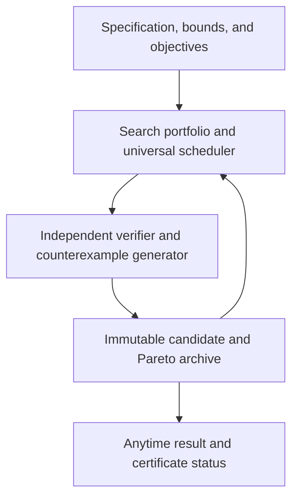

# Certified Universal Evolution

> **Status:** Exploratory research note. This is not an accepted ADR or an implementation
> commitment.
>
> **Purpose:** Preserve the design direction, its mathematical limits, the prerequisites that
> must be proven first, and the questions that remain open before Concerto adopts an evolutionary
> optimization mode.

## 1. Desired outcome

Concerto should be able to search for exceptional implementations for as long as the user permits,
without losing genuine progress or collapsing permanently onto the first promising design. At any
time it should return the strongest verified result found so far. In bounded domains, it should be
able to return an optimality certificate rather than merely claim that a candidate is impressive.

The ambition is broader than best-of-N sampling:

- preserve every non-dominated verified advance;
- continue exploring after finding a good solution;
- escape local optima through diverse and non-local search;
- prevent any search strategy from being starved forever;
- use counterexamples as permanent search knowledge;
- distinguish verified correctness, best-known quality, and proven global optimality;
- support results that can exceed normal human optimization when the specification is strong enough.

## 2. Fundamental limits

There is no universally best arbitrary program.

- The unrestricted program space is infinite.
- Program equivalence and many correctness properties are undecidable.
- Correctness cannot be inferred from an incomplete specification.
- Latency, memory, binary size, portability, security, readability, and maintainability conflict.
- Some problems do not have a single asymptotically fastest implementation.

Global optimality is therefore meaningful only relative to declared bounds:

> Within candidate grammar **G**, satisfying specification **S**, under environment **E** and cost
> model **C**, candidate **P** is globally optimal.

If the candidate space is finite and the verifier and cost model are exact, exhaustive search,
branch-and-bound, SMT/SAT solving, or a matched lower bound can eventually prove that no better
candidate exists. In unrestricted spaces the system can be complete only in the limit: it may keep
improving forever, but generally cannot know that a better program does not exist.

## 3. Required result language

Concerto must never collapse different confidence levels into a single "optimal" label.

| Result status | Meaning |
|---|---|
| **Verified correct** | The candidate passed the declared proof and evaluation gates. |
| **Best observed** | It has the strongest measured objective values among evaluated candidates. |
| **Archive Pareto member** | No evaluated candidate is at least as good on every declared axis and better on one. |
| **Certified optimal within bounds** | A proof, complete search, or matched lower bound establishes that no better candidate exists inside the declared domain. |

"No verified solution found" is also a valid result. Repair and synthesis tasks must not present a
least-bad failing candidate as a valid incumbent.

These states must be mechanically distinct, not display labels on one loosely
typed record. An implementation should use a sealed Rust enum whose variants
carry the evidence required for that claim—for example `BestObserved` cannot be
passed to an API requiring `VerifiedCorrect`, and `CertifiedOptimal` must carry
a checkable domain/certificate reference. Promotion between variants occurs
only through verifier constructors. Serialization must preserve the variant so
a refactor cannot silently collapse confidence levels.

## 4. Proposed mathematical core

The working direction is **Certified Universal Evolution**: a heterogeneous, anytime search
portfolio whose creative engines are separated from an independent verifier.

### 4.1 Universal resource scheduling

Levin-style dovetailing gives every registered search strategy a non-zero compute allocation. A
simple prior assigns strategy `i` a weight proportional to:

```text
w_i ∝ 2^(-L_i)
```

where `L_i` is a description-length or complexity penalty. A practical scheduler should combine:

- adaptive allocation to strategies producing useful marginal improvements;
- a guaranteed exploration reserve so no strategy is permanently abandoned;
- restarts from old, rare, and non-dominated archive branches;
- hard user ceilings for time, tokens, money, energy, and concurrent evaluations.

This does not make literal universal search practical. It imports the valuable property that an
included solver capable of finding a result is eventually given enough time to do so.

### 4.2 Thermodynamic exploration

Replica-exchange or parallel-tempering search provides multiple exploration regimes:

- cold replicas refine verified incumbents;
- warm replicas accept some temporary regressions to cross barriers;
- hot replicas make algorithmic, representational, or architectural jumps;
- replicas exchange candidates when the exchange improves mixing.

Correctness is a hard constraint rather than a soft fitness term:

```text
E(P) = infinity                 if any mandatory correctness or safety gate fails
E(P) = measured_cost_vector(P)  otherwise
```

The archive must nevertheless retain a structured **violation vector** for
invalid candidates: which mandatory gates passed, the failing property,
counterexample, distance/coverage metrics where meaningful, and verifier
diagnostics. Search strategies may use that vector to navigate toward the valid
region, but it must never reduce the infinite validity penalty or promote a
failing candidate. This separates a strict feasibility boundary from the
gradient needed by annealing, Bayesian optimization, and repair workers.

Quantum-inspired "tunnelling" should initially mean non-local mutation: replacing an algorithm,
data representation, module boundary, or execution strategy rather than merely editing nearby
tokens. Actual quantum hardware is not a prerequisite and does not remove verification or
computability limits.

### 4.3 Counterexample-guided synthesis

The core learning cycle should follow CEGIS principles:

1. a generator proposes a candidate;
2. an independent verifier either certifies it or produces a counterexample;
3. the counterexample enters an immutable counterexample bank;
4. all future candidates must satisfy the accumulated evidence;
5. the generator receives useful failure artifacts without receiving hidden verifier contents.

The generator may be probabilistic. The verifier must be reproducible, adversarial, and outside
the candidate's control.

### 4.4 Equality saturation and superoptimization

Evolution should be one member of the portfolio, not the only optimizer.

- LLM workers propose semantic changes, algorithms, and representations.
- Evolutionary workers explore related families and crossovers.
- CEGIS/SyGuS/SMT workers synthesize or eliminate candidates from formal specifications.
- Equality saturation preserves equivalent representations and avoids premature rewrite ordering.
- Superoptimizers search small critical functions or instruction sequences.
- Property-based and coverage-guided adversaries search for counterexamples.

This creates multiscale optimization from architecture to instruction selection.

## 5. Reference architecture



### 5.1 Candidate record

Every archived candidate should be immutable and include:

- candidate ID and parent IDs;
- base commit or source digest;
- patch or canonical program representation;
- generator, provider, model, prompt, toolchain, and configuration versions;
- random seeds and execution environment identity;
- verifier manifest and evidence hashes;
- correctness, safety, and policy gate results;
- objective measurements with uncertainty;
- time, token, financial, and energy cost;
- counterexamples discovered;
- lineage and migration history.

### 5.2 Pareto archive

Correctness and safety are mandatory gates. Verified candidates are retained along a Pareto
frontier rather than compressed into a single weighted score. Initial objective axes may include:

- worst-case complexity or proved bounds;
- measured latency distribution;
- peak memory and allocation behavior;
- binary size;
- dependency and platform footprint;
- security properties;
- implementation or patch complexity.

User-selected weights may choose a candidate from the frontier, but should not destroy alternatives.

### 5.3 Two incumbent modes

**Optimization mode** begins with a candidate already proven valid under the current verifier. It
can always return at least that valid incumbent.

**Repair/synthesis mode** may begin without any valid candidate. It maintains a best-evidence
candidate for diagnostics, but does not call that candidate valid until all mandatory gates pass.

## 6. Verifier prerequisites

No evolutionary implementation should start until the evaluator can resist optimization pressure.

Required properties:

- task snapshots resolve deterministically relative to their manifests;
- hidden tests and proof inputs live outside candidate workspaces;
- tests, benchmarks, evaluator settings, and scoring code are immutable during a run;
- candidates execute in isolated workspaces with network and resource controls;
- allowed mutation paths are explicit and enforced;
- baseline pass/fail state is checked before a run;
- correctness gates are lexicographically stronger than performance objectives;
- repeated performance samples include noise and confidence estimates;
- toolchains, dependencies, hardware, configuration, and source revisions are recorded;
- verifier results and artifacts are reproducible from an immutable manifest;
- held-out evaluation is independent from candidate and visible-test generation.

Infrastructure integrity is not evaluator-content integrity. Before a task
becomes an optimization target, an independent specification review must show
that the properties, oracle, golden master, and differential implementation
represent the intended behavior rather than faithfully preserving an existing
bug. The review should record requirement provenance, disputed cases, oracle
independence, mutation-test results, and approval by someone or something other
than the test generator. Hidden-test generation cannot validate its own
interpretation of an ambiguous specification.

The current categorized benchmark scaffolding is useful but does not yet meet these requirements.
Before using it as a fitness function, the eval runner needs a dedicated integrity audit and repair.

## 7. Experimental sequence

This sequence is deliberately decision-gated. Each stage must justify the next at an equal budget.

### Stage 0 — Evaluator integrity

- repair snapshot resolution and validate every task's intended starting state;
- establish hidden immutable verification;
- add full provenance and reproducible result manifests;
- add adversarial tests that attempt to modify or bypass the verifier;
- demonstrate that a no-op or test-editing agent cannot score as successful.
- perform independent evaluator-content review with requirement traceability,
  oracle cross-checks, and mutations that distinguish plausible wrong behavior
  from the intended contract;
- verify that per-gate failure artifacts provide useful search information
  without weakening the binary valid/invalid boundary.

**Gate:** independent reproduction produces the same result, and deliberate evaluator attacks fail.

### Stage 1 — Search baselines

Compare at equal spend:

1. a single normal AgentLoop run;
2. N independent samples;
3. one long sequential repair trajectory;
4. N samples followed by repair of the strongest M candidates.

**Gate:** establish pass@k, selection accuracy, reliability, and cost curves per benchmark category.

### Stage 2 — Immutable archive prototype

- persist candidates, evidence, lineage, and the Pareto frontier;
- add deterministic incumbent updates and checkpoint/resume;
- retain counterexamples and failed approaches as search knowledge;
- use a simple population before introducing MAP-Elites niches.

**Gate:** archive-guided search beats the strongest Stage 1 baseline at equal spend on at least one
well-verified task family without regressing correctness.

### Stage 3 — Tempered islands

- introduce cold, warm, and hot worker populations;
- add non-local mutations, migration, diversity measurements, and restarts;
- reserve compute through dovetail scheduling while allocating the majority adaptively;
- measure whether islands contribute distinct improvements rather than duplicate work.

**Gate:** tempered islands improve the Pareto frontier or time-to-best over a single population at
equal compute.

### Stage 4 — Certified domain optimizers

- add equality saturation for suitable representations;
- integrate formal solvers and CEGIS for bounded domains;
- add superoptimization for small hot paths;
- emit proof or exhaustive-search certificates where possible.

**Gate:** produce at least one result certified optimal within a declared grammar, environment, and
cost model.

### Stage 5 — Inward evolution

Only after the evaluator is contamination-resistant, consider evolving Concerto's prompts, routing,
search operators, and agent topologies against held-out benchmark suites. Self-modifications require
the same evidence, provenance, rollback, and policy gates as user-code candidates.

## 8. Initial target domains

Strong early targets have cheap, objective, repeatable verification:

- parsers, codecs, and protocol state machines;
- numerical and mathematical kernels;
- schedulers and query plans;
- compression, indexing, and data structures;
- critical loops and bounded pure functions;
- allocation, routing, or packing problems with simulators.

Whole business applications are poor first targets unless their behavioral contract has already
been converted into independent properties, golden masters, differential checks, and hidden tests.
Every golden master still requires independent content validation; reproducibly
matching a shipped bug is not correctness.

## 9. Open decisions

No choice below is accepted by this note:

- Which first domain provides a strong enough verifier and meaningful optimization target?
- What candidate grammar is bounded enough to permit certification but rich enough for discovery?
- Which objectives belong on the initial Pareto frontier?
- What proportion of compute is adaptive versus guaranteed exploration reserve?
- How should performance noise and hardware variance be modelled?
- Which isolation mechanism is viable across Linux, Windows, and macOS?
- When does a candidate become eligible to seed another branch?
- What behavior descriptors, if any, justify MAP-Elites rather than a simple archive?
- Which proof systems and solvers should be trusted, and how are certificates independently checked?
- What equal-budget improvement is large enough to justify production Evolve Mode?

## 10. Research basis

Primary starting points:

- Levin/universal search and asymptotically optimal resource allocation:
  <https://www.idsia.ch/~juergen/optimalsearch.html>
- Gödel machines and proof-gated self-improvement: <https://arxiv.org/abs/cs/0309048>
- Darwin Gödel Machine and open-ended agent archives: <https://arxiv.org/abs/2505.22954>
- Repeated-sampling inference scaling: <https://arxiv.org/abs/2407.21787>
- Reward hacking in iterative code optimization:
  <https://openreview.net/forum?id=ikrQWGgxYg>
- Syntax-guided synthesis: <https://www.cis.upenn.edu/~alur/SyGuS13.pdf>
- Counterexample-guided synthesis modulo theories:
  <https://www.kroening.com/papers/cav2018-synthesis.pdf>
- Equality saturation and `egg`: <https://arxiv.org/abs/2004.03082>
- Stochastic superoptimization and STOKE: <https://arxiv.org/abs/1211.0557>
- Quantum annealing limitations and industrial evidence: <https://arxiv.org/abs/2112.07491>

STOKE is more than an analogy: it is practical evidence that stochastic
MCMC/annealing search with a hard correctness test and soft performance cost can
discover strong implementations for small critical functions. It supports the
mechanical core of §4.2 at that scale, while providing no evidence that the
surrounding evaluator, whole-program search space, or universal scheduling
problem is already solved.

## 11. Relationship to the enhancement research report

This note preserves and extends the direction proposed in *Concerto Evolve Direction — Research
Report* while correcting its assumptions about the current codebase:

- categorized benchmark directories and pass-rate scaffolding already exist;
- hidden and immutable evaluation do not yet exist;
- temporary-directory execution is not a general security sandbox;
- the current evaluator must be proven to resolve and evaluate the intended task snapshots;
- best-of-N should be compared with sequential and hybrid repair, not treated as the only baseline;
- MAP-Elites and island migration are later empirical decisions, not initial requirements;
- valid-incumbent guarantees apply to optimization, not automatically to repair or synthesis.

The report remains useful evidence for the direction. This note is the working index for future
design and implementation discussions.
